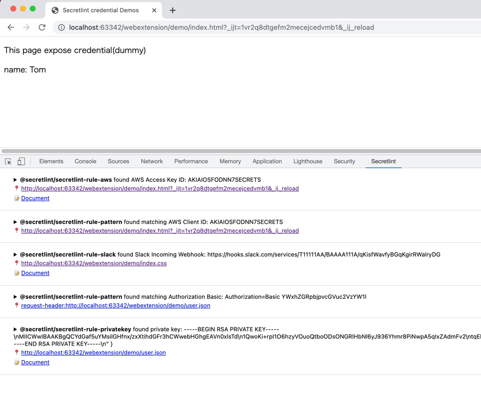

# Secretlint WebExtension

[Secretlint](https://github.com/secretlint/secretlint) founds credentials that are included in your request/response.

- Firefox: <https://addons.mozilla.org/ja/firefox/addon/secretlint/>
- Chrome: <https://chrome.google.com/webstore/detail/secretlint/hidpojbnemkajlnibhmeilpgoddkjjkf>

This Web Extension integrate [secretlint](https://github.com/secretlint/secretlint) with browser's devTools.

## Features

- Check that request/response includes credentials
- DevTools integration
    - Output found credentials to "Console" panel(option)
    - Output found credentials to "Secretlint" panel

## Motivation

Everyone makes mistakes.

A developer sometimes expose own credentials like OAuth token in a website accidentally.

[secretlint](https://github.com/secretlint/secretlint) can found credentials in file.
However, The exposed credentials come from environments variables or Database, so These are not embed in a file.

We want to found these exposed credentials.

Security researcher use proxy software like [Burp Suite](https://portswigger.net/burp), but web developer use DevTools instead of it.

Secretlint WebExtension integrate to DevTools in Chrome/Firefox.
Secretlint WebExtension help web developer to notice exposed credential.

## Install

- Firefox: <https://addons.mozilla.org/ja/firefox/addon/secretlint/>
- Chrome: <https://chrome.google.com/webstore/detail/secretlint/hidpojbnemkajlnibhmeilpgoddkjjkf>

## Usage

1. Open browser's Developer Tools
2. ✅ Disable Cache
3. Reload page and secretlint report found credentials in your request/response.

## Config

### Configurable Patterns

You can add patterns and found your secrets. 

These patterns are based on [@secretlint/secretlint-rule-pattern](https://github.com/secretlint/secretlint/tree/master/packages/%40secretlint/secretlint-rule-pattern).
Each pattern should have following properties. If match the pattern, report it as error.

- name: pattern name
- pattern: string or [RegExp-like String](https://github.com/textlint/regexp-string-matcher#regexp-like-string) (/pattern/)

Default patterns are defined in [rule.patterns.ts](app/scripts/secretlint/rule.patterns.ts).

## Development

    yarn install
    # Chrome
    yarn dev chrome
    # Firefox
    yarn dev firefox

## Changelog

See [Releases page](https://github.com/secretlint/webextension/releases).

## Running tests

Install devDependencies and Run `npm test`:

    npm test

## Contributing

Pull requests and stars are always welcome.

For bugs and feature requests, [please create an issue](https://github.com/secretlint/webextension/issues).

1. Fork it!
2. Create your feature branch: `git checkout -b my-new-feature`
3. Commit your changes: `git commit -am 'Add some feature'`
4. Push to the branch: `git push origin my-new-feature`
5. Submit a pull request :D

## Author

- azu: [GitHub](https://github.com/azu), [Twitter](https://twitter.com/azu_re)

## License

MIT © azu
